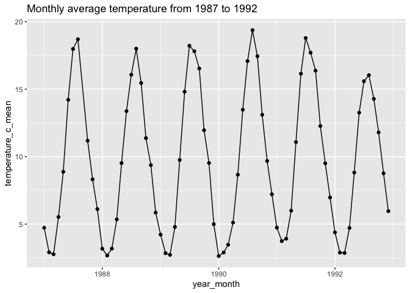
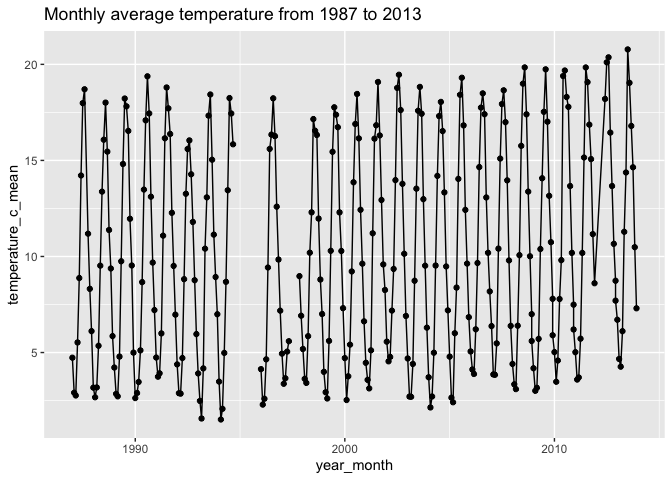
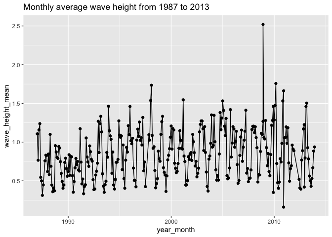

Assignment 8: Iteration and conditional execution
================

<br>

## Instructions: Please read through this before you begin

-   This homework is due by **10pm on Wednesday 04/07/20**. Please upload it using your personal GitHub repository for this class.

-   Please name your R markdown file `assignment_8.Rmd` and the knitted markdown file `assignment_8.md`.

-   For this assignment, please **reproduce this markdown file** using R markdown. This includes the followings:

    -   **Reproduce this markdown template**, except for this list of instructions which you **don't** have to include. Pay attention to all the formating in this file, including bullet points, bolded characters, inserted code chunks, headings, text colors, blank lines, etc.

    -   Have all your code embedded within the R markdown file, and show **BOTH your code and plots** in the knitted markdown file.

    -   Use R Markdown functionalities to **hide messages and warnings when needed**. (Suggestion: messages and warnings can often be informative and important, so please examine them carefully and only turn them off when you finish the exercise).

-   To start, first load all the required packages with the following code. Install them if they are not installed yet.

``` r
library(tidyverse)
```

<br>

**Acknowledgements:** Exercise 1 has been adapted (with permission) from the [Data Carpentry for Biologists semester course](https://datacarpentry.org/semester-biology/exercises/Functions-use-and-modify-Python/) and exercises 2 was adapted (with permission) from Iain Carmichael's course [STOR 390: Introduction to Data Science](https://idc9.github.io/stor390/#course_material).

<br>

**Note:** In this assignment, for loops are written in a way such that the output is grown in each iteration using functions such as `c()` and `bind_rows()`. Although this is perhaps a more intuitive method, be aware that it is less efficient computationally compared to predefining the length of the output. For more information on this, we highly recommend you to read the [for loops section](https://r4ds.had.co.nz/iteration.html#for-loops) in the R for Data Science book.

<br>

## Exercise 1: Body mass estimation using vectorization vs. for loop

There are two major types of approaches to perform multiple operations in R: [vectorization](https://swcarpentry.github.io/r-novice-gapminder/09-vectorization/) and for loops. As a simple example, to calculate the sum of two vectors, `x` and `y`, the syntax for vectorization is simply `z <- x + y`. With this, the computer will be able to perform the same operation to each element of x and y vector **simultaneously**.

The for loop approach to achieve the same task (create a new vector z that is the sum of vectors x and y), on the other hand, takes the following form:

``` r
z <- NULL
for (i in 1:length(x)){
  z <- c(z, x[i] + y[i])
}
```

In this case, the computer loops through each element of x and y and performs the operation **sequentially**, resulting in a significantly longer runtime. Let's now try to quantify this difference in runtime in this exercise.

<br>

#### 1.1 A single operation

The length of an organism is typically strongly correlated with its body mass. This is useful because it allows us to estimate the mass of an organism even if we only know its length. This relationship generally takes the form: `mass = a * length ^ b`, where the parameters `a` and `b` vary among groups. This allometric approach is regularly used to estimate the mass of dinosaurs since we cannot weigh something that is only preserved as bones.

*Spinosaurus* is a predator that is bigger, and therefore, by definition, cooler, than that stupid *Tyrannosaurus* that everyone likes so much. It has an estimated `a` of `0.73` and `b` of `3.63`. What is the estimated mass of a *Spinosaurus* that is `16` m long based on its reassembled skeleton?

    ## [1] 17150.56

<br>

#### 1.2 Multiple operations

The following vectors contain the `length`s of 40 dinosaurs and their respective `a` and `b` values. Estimate their `mass` first using a vectorization approach and then using a for loop approach.

``` r
dinosaur_lengths <- c(17.8013631070471, 20.3764452071665, 14.0743486294308, 25.65782386974, 26.0952008049675, 20.3111541103134, 17.5663244372533, 11.2563431277577, 20.081903202614, 18.6071626441984, 18.0991894513166, 23.0659685685892, 20.5798853467837, 25.6179254233558, 24.3714331573996, 26.2847248252537, 25.4753783544473, 20.4642089867304, 16.0738256364701, 20.3494171706583, 19.854399305869, 17.7889814608919, 14.8016421998303, 19.6840911485379, 19.4685885050906, 24.4807784966691, 13.3359960054899, 21.5065994598917, 18.4640304608411, 19.5861532398676, 27.084751999756, 18.9609366301798, 22.4829168046521, 11.7325716149514, 18.3758846100456, 15.537504851634, 13.4848751773738, 7.68561192214935, 25.5963348603783, 16.588285389794)

a_values <- c(0.759, 0.751, 0.74, 0.746, 0.759, 0.751, 0.749, 0.751, 0.738, 0.768, 0.736, 0.749, 0.746, 0.744, 0.749, 0.751, 0.744, 0.754, 0.774, 0.751, 0.763, 0.749, 0.741, 0.754, 0.746, 0.755, 0.764, 0.758, 0.76, 0.748, 0.745, 0.756, 0.739, 0.733, 0.757, 0.747, 0.741, 0.752, 0.752, 0.748)

b_values <- c(3.627, 3.633, 3.626, 3.633, 3.627, 3.629, 3.632, 3.628, 3.633, 3.627, 3.621, 3.63, 3.631, 3.632, 3.628, 3.626, 3.639, 3.626, 3.635, 3.629, 3.642, 3.632, 3.633, 3.629, 3.62, 3.619, 3.638, 3.627, 3.621, 3.628, 3.628, 3.635, 3.624, 3.621, 3.621, 3.632, 3.627, 3.624, 3.634, 3.621)
```

<br>

-   with vectorization:

<!-- -->

    ##  [1]  26039.686  42825.603  10800.224  98273.049 104257.481  41822.386
    ##  [7]  24840.644   4899.022  39915.948  30937.922  26354.908  66384.865
    ## [13]  43837.944  97141.451  80553.856 105556.405  97374.660  42760.136
    ## [19]  18749.274  42109.012  40674.182  26003.425  13229.824  37472.789
    ## [25]  34684.033  80187.272   9460.977  51630.571  29253.772  36399.306
    ## [31] 117511.962  33384.288  58581.226   5462.316  28637.745  15864.172
    ## [37]   9284.810   1218.755  98522.609  19534.524

**Hint:** If you are unsure about how vectorized operations work, check out the results that the following lines return.

``` r
c(1, 2, 3) + c(4, 5, 6)
c(1, 2, 3) * c(4, 5, 6)
```

<br>

-   with a for loop:

<!-- -->

    ##  [1]  26039.686  42825.603  10800.224  98273.049 104257.481  41822.386
    ##  [7]  24840.644   4899.022  39915.948  30937.922  26354.908  66384.865
    ## [13]  43837.944  97141.451  80553.856 105556.405  97374.660  42760.136
    ## [19]  18749.274  42109.012  40674.182  26003.425  13229.824  37472.789
    ## [25]  34684.033  80187.272   9460.977  51630.571  29253.772  36399.306
    ## [31] 117511.962  33384.288  58581.226   5462.316  28637.745  15864.172
    ## [37]   9284.810   1218.755  98522.609  19534.524

<br>

#### 1.3 Runtime comparison

The function `system.time()` can be used to record the runtime of an operation. For example, `system.time(rnorm(100000))` can give you the time to draw 100000 samples from a normal distribution. Here, use `system.time()` to record the runtime of the vectorization approach and the for loop approach in the previous question.

-   vectorization:

<!-- -->

    ##    user  system elapsed 
    ##       0       0       0

-   for loop:

<!-- -->

    ##    user  system elapsed 
    ##   0.006   0.000   0.006

<br>

Although the for loop in this exercise can be run very quickly, it is noticeably slower than the vectorization approach. With more complicated operations, vectorization can often shorten the runtime of a for loop from days to minutes.

**Note:** the actual runtime depends on the computing power of your computer, so there may not be a noticeable difference between the two approaches if your computer is sufficiently fast.

<br>

## Exercise 2: Data inputting and wrangling in batch

Another instance where loops are useful is data input / output in batch. We've learned how to make plots and output them in batch in class, so in this exercise, you will use for loops to automate the inputting and wrangling process of a group of datasets with similar names and formats in the <https://github.com/nt246/NTRES-6100-data-science/tree/master/datasets/buoydata>.

#### 2.1 Given the following code chunk for reading buoy data files from buoy 44013 for each year, describe the following:

-   What parts of your code are consistent across every line/code chunk?
-   What parts are different?

``` r
buoy_1987 <- read_csv('https://raw.githubusercontent.com/nt246/NTRES-6100-data-science/master/datasets/buoydata/44013_1987.csv', na = c("99", "999", "99.00", "999.0"))
buoy_1988 <- read_csv('https://raw.githubusercontent.com/nt246/NTRES-6100-data-science/master/datasets/buoydata/44013_1988.csv', na = c("99", "999", "99.00", "999.0"))
buoy_1989 <- read_csv('https://raw.githubusercontent.com/nt246/NTRES-6100-data-science/master/datasets/buoydata/44013_1989.csv', na = c("99", "999", "99.00", "999.0"))
buoy_1990 <- read_csv('https://raw.githubusercontent.com/nt246/NTRES-6100-data-science/master/datasets/buoydata/44013_1990.csv', na = c("99", "999", "99.00", "999.0"))
```

Answer: <span style="color:blue"> Write your response here. </span>

<br>

#### 2.2 Complete the skeleton of the for loop below, which uses the `str_c()` function to print out the path to the buoy 44013 data file from year `start` to `end`

**Hint:** `str_c()` is the tidyverse version of `paste()` that was mentioned in class. Use its help file (`?str_c`) to check out how it works.

``` r
start <- 1987
end <- 1992
for (year in start:end){
  path <- str_c(________________________________________________________________________________________________________)
  print(path)
}
```

Here is how it should work with `start = 1987` and `end = 1992`:

    ## [1] "https://raw.githubusercontent.com/nt246/NTRES-6100-data-science/master/datasets/buoydata/44013_1987.csv"
    ## [1] "https://raw.githubusercontent.com/nt246/NTRES-6100-data-science/master/datasets/buoydata/44013_1988.csv"
    ## [1] "https://raw.githubusercontent.com/nt246/NTRES-6100-data-science/master/datasets/buoydata/44013_1989.csv"
    ## [1] "https://raw.githubusercontent.com/nt246/NTRES-6100-data-science/master/datasets/buoydata/44013_1990.csv"
    ## [1] "https://raw.githubusercontent.com/nt246/NTRES-6100-data-science/master/datasets/buoydata/44013_1991.csv"
    ## [1] "https://raw.githubusercontent.com/nt246/NTRES-6100-data-science/master/datasets/buoydata/44013_1992.csv"

<br>

#### 2.3 Complete the skeleton of the for loop below, which reads the buoy 44013 data file from year `start` to `end` and combine them together

``` r
start <- 1987
end <- 1992
df_combined <- NULL
for (year in start:end){
  path <- str_c(________________________________________________________________________________________________________)
  df <- read_csv(___________________________________________)
  df_combined <- _________________________
}
dim(df_combined)
```

Here is the dimension of the combined data frame with `start = 1987` and `end = 1992`:

    ## [1] 49775    16

<br>

#### 2.4 Building on the workflow that you used in 2.1 - 2.3, use a for loop to read in, clean up, and summarize the buoy data from all years from 1987 to 1992 using a dplyr workflow.

**Select** only the columns `YY` (year), `MM` (month), `WVHT` (wave heights), `WTMP` (temperatures) and **rename** these columns to something understandable. **Summarize** monthly averaged wave heights and temperatures throughout the years in a tibble, and **plot the variation of these monthly averaged values through time** as shown below.

There are multiple ways to do this, and for this exercise, you may well combine all the raw data in a for loop and clean it up after the loop. In the next exercise, however, you will need to clean up the data in the loop before you can combine them.



<br>

#### 2.5 Now, further generalize your loop so that it works for any year **between 1987 and 2013**. **Here are a few things that you should pay attention to:**

-   The first three column have consistently contained information on year, month, and date (and in that order), but they have had different names throughout the years.

-   The first column (year) followed a two-digit format from 1987 to 1998, but has (understantably) switched to a four-digit format since 1999.

-   Starting from 2007, a second row appears after the header to show the unit for each column, and it needs to be filtered out.

**Hints**:

-   use conditional execution to deal with the inconsistencies above

-   don't worry about parsing failures in columns other than the ones that you will use for this excercise

-   there is a lot of missing temperature data during the mid 90s, resulting in a gap in the time series. The wave height data, however, appears to be continuous



<br>
